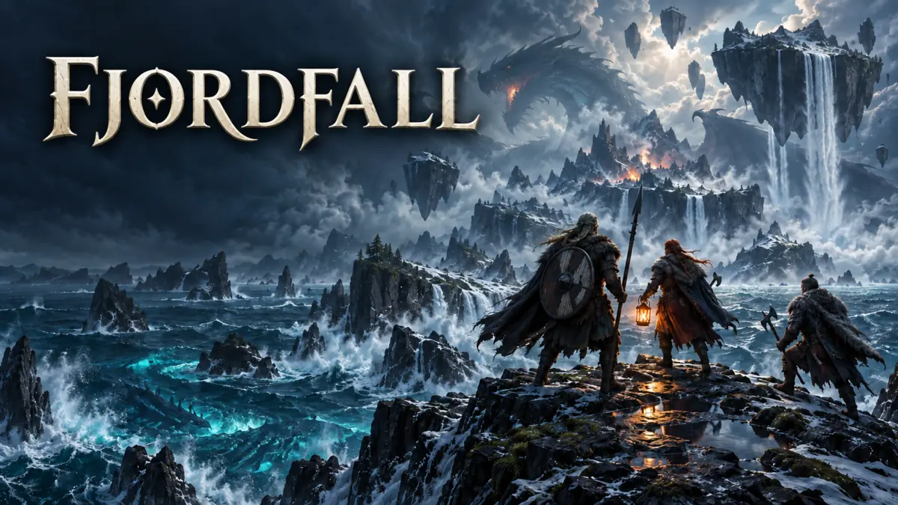

<div align="center">



# Fjordfall: The Dragon Hunt

**Gather your warband. Hunt across five realms. Face the dragon.**

[](https://github.com/h00w/fjordfall/actions/workflows/ci.yml)
[](https://fjordfall-uniplay.hendar2-0.chatgpt.site)
[](#play-modes)
[](#how-to-play)

[](https://hendarmawan.se)
[](https://www.linkedin.com/in/hender/)
[](https://github.com/h00w)
[](https://huggingface.co/h0000w)

</div>

A name-only multiplayer Viking arena for 1–10 people. Create a six-character room, share its invite URL, and let the room creator start whenever they wish.

## Public playable demo

**[Play Fjordfall in your browser](https://fjordfall-uniplay.hendar2-0.chatgpt.site)**. The public deployment is available without a game account. The source and cover art are in this repository so the game can also be run locally.

### How to play

1. Type a Viking name and create a room. Share the six-letter code or the invite link with friends. Everyone joins with a name only—no game account is required.
2. The room creator chooses **Crew vs AI** (one to ten players, with **Slow**, **Medium**, or **Hard** monsters) or **Player duel** (two to ten players). Others may mark themselves ready; the creator can start whenever the chosen mode has enough players.
3. In Crew vs AI, move close to a monster and fight. A Viking ally helps each successful strike. Watch the damage burst, monster and Viking health bars, and live points. When a monster falls, reach the opened Rune Gate and interact to take the entire crew to the next realm. Revive a downed teammate by staying close for three seconds.
4. Clear the islands, waterfall sky islands, sea, underwater ruins, and finally the dragon's roost. Defeat Fjordwyrm to win. In Player duel, the last standing Viking wins instead.
5. After victory or defeat, compare the final leaderboard. Each point of damage earns 10 points; a final strike adds 80, and a successful revive adds 50. Monster strikes and damage points are shown too. Scores total across all five realms and reset at the start of a new round. The room creator can replay with the same group.

For a quick solo demo, create a room, choose **Crew vs AI → Slow**, and start immediately. To verify multiplayer, open the invite on a second browser/device, enter a different name, then start from the creator's tab. Both views should show the same roster, position, health, stage, and result.

## Play modes

| Mode | Players | Goal |
| --- | --- | --- |
| Crew vs AI | 1–10 | Defeat the server-controlled monster in each realm, activate the Rune Gate, and defeat Fjordwyrm. Viking allies add damage to each landed strike. |
| Player duel | 2–10 | Fight other players. The last Viking standing wins. |

The creator selects **Slow**, **Medium**, or **Hard** AI in crew mode. Slow enemies move and strike every 1.6 seconds; Medium enemies act every 0.8 seconds and hit harder. Hard enemies act every 0.55 seconds, pursue farther, deal three base damage per hit, and have 50% more health in every realm. Each new realm raises every monster’s base damage by one; a critical strike adds a random two or three damage. Killing each monster triggers a shared level-up popup and grants every living Viking +2 HP, increasing the maximum from 10 at Raven Shore to 18 before the dragon and 20 after the final victory. Entering a Rune Gate fully heals the crew to the new maximum. Ready indicators help coordinate the lobby, but they do not prevent the creator from starting. The same room code works for replays.

Players choose a name; there is no account or game login. A random room token stays in the browser tab's session storage, so refreshing retains that player's identity. Room state, movement, damage, cooldowns, enemy AI, revival, stage progression, victory, and replay are validated on the server and stored in D1. Clients poll canonical snapshots every 700 ms.

## Controls

- **WASD / arrow keys:** move. On a phone or desktop, use the visible directional pad.
- **Space / Enter / F / Fight:** strike a nearby monster or duel opponent.
- **R / Revive:** start reviving a downed teammate within range. Stay nearby for three seconds.
- **E / Enter Gate:** enter an open Rune Gate after defeating a realm's monster.

The arena shows the enemy health bar, monster strikes and score, each Viking's health and points, a personal combat HUD, and a damage burst for landed attacks from either side. The right-hand warband panel shows every player's current strikes, health, and score. After a round ends, the final leaderboard ranks all players by score and shows strikes, revives, total crew points, and the monsters' total damage points.

The five encounters are Raven Shore (islands), Hanging Falls (waterfall sky islands), Whale Road (sea), Sunken Hall (underwater), and Dragon's Roost.

## Run locally

Node.js 22.13+ and pnpm 11 are required. The app uses Vinext, Vite, Cloudflare Workers, and D1.

```bash
pnpm install --frozen-lockfile
pnpm run typecheck
pnpm test
pnpm build
for migration in drizzle/*.sql; do
  npx wrangler d1 execute DB --local --config dist/server/wrangler.json \
    --persist-to .wrangler/state --file "$migration"
done
pnpm start
```

Apply each migration only once to a given local database. For a fresh database the loop applies them in order. `pnpm dev` runs Vite's development server; use the built Worker command above when checking D1 end to end.

To deploy, provide a Cloudflare D1 binding named `DB` and apply the checked-in Drizzle migrations in order. The `.openai/hosting.json` file declares the logical binding for Sites; no Site ID or credential is committed. A static file host alone cannot serve the room API.

## Verification

`pnpm test` exercises the actual API route with an in-memory SQLite D1 adapter: name-only joins, invalid/full rooms, ten players, host controls, movement sync, shared damage feedback and scores, five stage gates, slow/medium/hard AI, down/revive/team wipe, PvP, and three replay cycles with clean scoring resets. `pnpm run typecheck` and `pnpm build` verify the client and Worker bundle. See [the manual device checklist](docs/TESTING.md) for checks that require separate browsers and phones.

The source and playable deployment are public. A room still requires a Viking name, and the host controls when each round starts.
